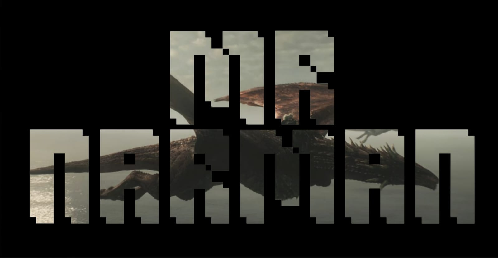

## 🐉 Fire and Code.

### 🔥 House Narman — *"Fire and Code"* 🔥

I am **Godrick Narman** — of the blood of the dragon, heir to the old Valyrian crafts of **Robotics**, **Artificial Intelligence**, and **Machine Learning**.

Dragons do not flatter their riders — they test them. So too does code test the coder. I have flown that fire, and I have not been burned.

> 🐲 **Innovation** is my dragon's wing.  
> 🔥 **Intelligence** is my fire made flesh.  
> 👑 **Purpose** is my claim to the throne of clean code.  
>  
> *Fire cannot kill a dragon, and bugs cannot kill my will to build.*

## 🏰 Dragonstone (Learning Stack)

## 🐦 Send a Raven (Summon Me)

  
  
  

## 📜 The Grand Maester's Ledger (GitHub Stats)

🐦 *Ravens received:* 

### 🏆 Trophies of the Realm

## 🔮 Words of House Narman
_"Fire and Code — for a dragon that does not fly is just a very large, very expensive lizard, and code that does not run is just a very long, very expensive text file."_

